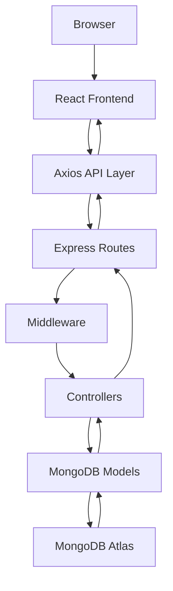
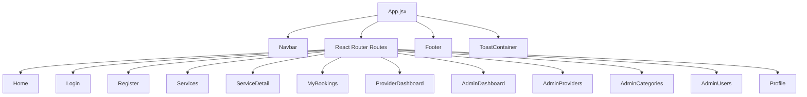
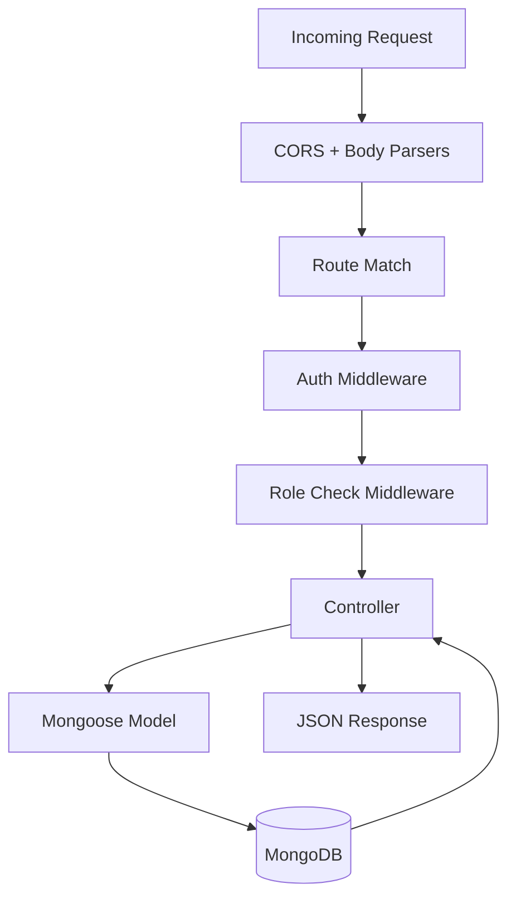
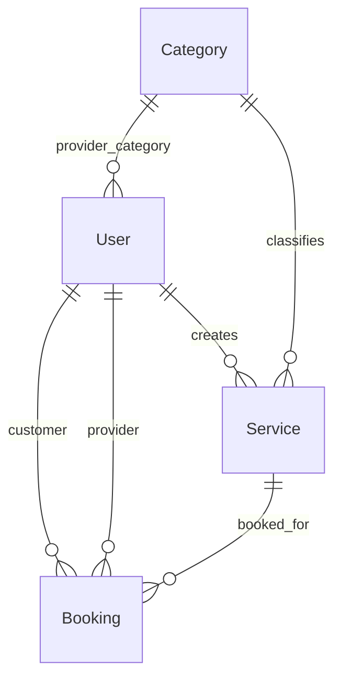
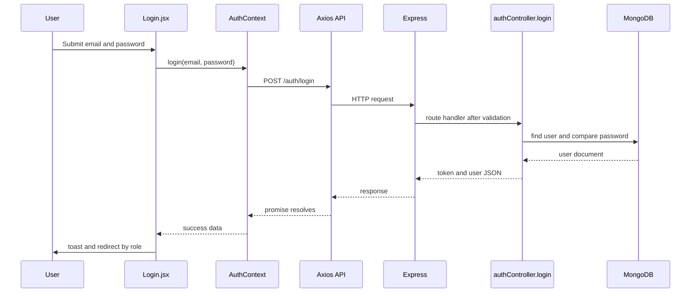
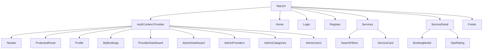

# ServeNear Project Complete Guide

## 1. What This Project Is

ServeNear is a MERN marketplace for local service discovery and booking. It connects customers who need home or field services with service providers who can list offers, receive bookings, and manage job status. Admin users supervise the platform by verifying providers, managing categories, and monitoring growth metrics.

The project solves a specific operational problem: local service marketplaces often fail when discovery, trust, and booking are split across multiple tools. ServeNear keeps those concerns in one app by combining search, verified provider profiles, booking workflows, dashboard views, and administrative control.

The business purpose is to enable a service marketplace that can support customer acquisition, provider onboarding, booking conversion, and platform trust. The technical purpose is to demonstrate a complete MERN architecture with role-based access control, JWT authentication, MongoDB persistence, and a React UI that handles multiple user roles.

### Primary users

The app is designed for three user types:

| Role | What they do |
|---|---|
| Customer | Search services, inspect providers, create bookings, cancel pending bookings, manage their profile |
| Provider | Register as a provider, create and manage services, view bookings, update booking status, edit provider profile |
| Admin | Review and verify providers, manage categories, manage users, inspect platform statistics |

### Why MERN fits this project

MERN is a good fit because the app needs a fast-moving API, a flexible document database, and a React interface with many role-specific UI states. MongoDB matches the schema variability of provider profiles and bookings. Express keeps the backend thin and explicit. React makes the dashboard and discovery UI easy to compose from reusable components. Node.js gives the server one language and one toolchain across the stack.

### Design philosophy

The project uses a conventional full-stack marketplace architecture: React for presentation, Axios for API calls, Express for HTTP routing, middleware for security and authorization, controllers for business logic, and Mongoose models for database structure. The code favors clarity over abstraction. Most logic is placed directly in controllers and page components rather than in a heavy service layer.

## 2. High-Level Architecture

The application is split into two packages:

| Package | Path | Responsibility |
|---|---|---|
| Frontend | [client/](client/) | React UI, routing, forms, dashboard views, client-side auth state, API calls |
| Backend | [server/](server/) | Express API, auth, business logic, Mongoose models, MongoDB persistence |

### Request flow overview



### Why each layer exists

Browser and React handle interaction, state, and rendering. Axios centralizes token attachment and 401 handling. Express routes map URLs to controllers. Middleware enforces authentication and role checks before business logic runs. Controllers implement application behavior. Mongoose models define data shape, validation, hooks, indexes, and relationships. MongoDB Atlas stores the data.

### Layer responsibilities

| Layer | Responsibility | What it should not do |
|---|---|---|
| React pages/components | Render UI, manage local and contextual state, call API helpers | Contain server-side auth logic or database rules |
| Axios client | Standardize API base URL and token headers | Hold application state |
| Express routes | Map endpoints to handlers and middleware | Contain complex business rules |
| Middleware | Authenticate requests and enforce roles | Query unrelated business entities unnecessarily |
| Controllers | Validate request intent, orchestrate data access, shape responses | Become a second routing layer |
| Models | Define schema, validation, hooks, indexes, relationships | Render UI or call the frontend |

## 3. Folder-by-Folder Documentation

### [client/](client/)

Purpose: the React frontend application.

Contents: pages, components, context, utilities, CSS, static assets, Vite config, lint config, environment variables.

Responsibilities: user-facing routing, forms, dashboard interactions, local auth state, API consumption, and page layout.

Interactions: calls the backend under [server/](server/) through the shared Axios client in [client/src/utils/api.js](client/src/utils/api.js).

Should never contain: Mongoose models, route handlers, JWT verification, or MongoDB connection code.

Important files: [client/src/App.jsx](client/src/App.jsx), [client/src/context/AuthContext.jsx](client/src/context/AuthContext.jsx), [client/src/utils/api.js](client/src/utils/api.js), [client/src/pages/](client/src/pages/), [client/src/components/](client/src/components/).

Design decisions: HashRouter is used instead of BrowserRouter, which reduces deployment path issues on static hosts. The UI is organized by page plus reusable components instead of a heavy state-management library.

### [server/](server/)

Purpose: the Express and MongoDB backend API.

Contents: routes, controllers, middleware, models, database config, seeding utilities, and the server entrypoint.

Responsibilities: authenticate users, enforce roles, store and query documents, run platform business logic, and return JSON responses.

Interactions: consumed by the frontend through HTTP requests. The server also seeds default categories and an admin user on startup.

Should never contain: React components, browser routing, or CSS used only for the client.

Important files: [server/server.js](server/server.js), [server/config/db.js](server/config/db.js), [server/routes/](server/routes/), [server/controllers/](server/controllers/), [server/models/](server/models/), [server/middleware/](server/middleware/).

### [client/src/pages/](client/src/pages/)

Purpose: route-level screens.

Contents: home page, auth pages, service discovery, booking history, provider dashboard, admin dashboard, profile, and supporting CSS.

Responsibilities: assemble components, own page-local data fetching, and coordinate page-specific flows.

Should never contain: shared low-level widgets that belong in [client/src/components/](client/src/components/).

### [client/src/components/](client/src/components/)

Purpose: reusable UI elements.

Contents: navbar, footer, booking modal, protected route wrapper, loader, search filters, service card, star rating.

Responsibilities: shared rendering patterns and small pieces of interaction logic.

Should never contain: route definitions, page ownership, or large multi-screen flows.

### [client/src/context/](client/src/context/)

Purpose: application-wide React context.

Contents: authentication context.

Responsibilities: session state, login/logout actions, token persistence, and role flags.

### [client/src/utils/](client/src/utils/)

Purpose: non-visual helper modules.

Contents: Axios API client.

Responsibilities: API base URL, request interceptor, response interceptor.

### [client/src/assets/](client/src/assets/)

Purpose: static assets bundled by Vite.

Contents: logo and hero imagery.

Responsibilities: branding and page illustration.

### [client/public/](client/public/)

Purpose: files served as-is by the Vite dev server and build output.

Contents: favicon and SVG assets.

Should never contain: application logic.

### [server/routes/](server/routes/)

Purpose: HTTP endpoint declarations.

Contents: auth, services, bookings, categories, admin, and users routes.

Responsibilities: apply middleware and bind controller functions.

Should never contain: data mutations or direct database logic beyond dispatch.

### [server/controllers/](server/controllers/)

Purpose: business logic and response shaping.

Contents: auth, services, bookings, categories, admin, and user controllers.

Responsibilities: validate request data, query models, enforce rules, return responses.

Should never contain: route registration or UI logic.

### [server/models/](server/models/)

Purpose: Mongoose schema definitions.

Contents: User, Service, Category, Booking.

Responsibilities: document shape, validation, hooks, indexes, references.

Should never contain: Express request handling.

### [server/middleware/](server/middleware/)

Purpose: reusable request guards.

Contents: JWT auth middleware and role checker.

Responsibilities: authenticate requests and restrict access by role.

### [server/config/](server/config/)

Purpose: infrastructure configuration.

Contents: database connection helper.

### [server/utils/](server/utils/)

Purpose: boot-time helper scripts.

Contents: auto-seeding and manual seed data.

Responsibilities: initialize categories and a default admin account.

## 4. Repository Identification

The project is called ServeNear. It is a local services marketplace focused on Pakistan-based cities such as Abbottabad, Islamabad, Rawalpindi, Lahore, Karachi, Peshawar, Faisalabad, and Multan.

The product solves three linked problems:

1. Discovering nearby service providers.
2. Trusting the provider through verification and ratings.
3. Coordinating bookings and status changes.

The platform is technically a marketplace with three major state domains:

| Domain | Data owned | Main screens |
|---|---|---|
| Discovery | categories, services, provider profile data | Home, Services, Service Detail |
| Transactions | bookings and booking status transitions | Booking modal, My Bookings, Provider Dashboard |
| Administration | users, provider verification, category management, statistics | Admin Dashboard, Admin Providers, Admin Categories, Admin Users |

## 5. Architecture in Depth

### Frontend architecture

The frontend is a Vite-based React application. The app bootstraps from [client/src/main.jsx](client/src/main.jsx), which renders [client/src/App.jsx](client/src/App.jsx) inside React Strict Mode. The app uses [HashRouter](client/src/App.jsx) so routes survive static hosting without server-side rewrite configuration.

The top-level UI structure is:



The React app stores authenticated user state in context and localStorage. The server remains authoritative for access control, but the frontend adds route-level protection and navigational convenience.

### Backend architecture

The backend starts in [server/server.js](server/server.js). It loads environment variables, connects to MongoDB, auto-seeds data, registers middleware, mounts routers, exposes a health endpoint, and starts listening on the configured port.

The server follows a simple but readable Express flow:



### Why the layers exist separately

The separation keeps request handling understandable. Routes answer “what URL maps to what action.” Middleware answers “who is allowed.” Controllers answer “what the action does.” Models answer “what data looks like and how it is stored.”

This is not a repository-service pattern implementation. The controllers talk directly to the models, which keeps the code small but means future refactors may need service extraction if business rules grow.

## 6. File-by-File Documentation: Frontend Entry and Shared Infrastructure

### [client/src/main.jsx](client/src/main.jsx)

Purpose: application bootstrap.

It imports global CSS, imports the main app component, and renders the app into the root DOM node.

There is no state or data logic here. This file should stay minimal.

### [client/src/App.jsx](client/src/App.jsx)

Purpose: top-level routing and shell layout.

Responsibilities:

1. Create the router.
2. Wrap the tree in [AuthProvider](client/src/context/AuthContext.jsx).
3. Render [Navbar](client/src/components/Navbar.jsx) and [Footer](client/src/components/Footer.jsx) on every page.
4. Define public and protected routes.
5. Mount the toast notification container.

Routing model:

| Path | Element | Access |
|---|---|---|
| / | Home | Public |
| /login | Login | Public |
| /register | Register | Public |
| /services | Services | Public |
| /services/:id | ServiceDetail | Public |
| /profile | Profile | Authenticated |
| /bookings | MyBookings | customer or provider |
| /provider/dashboard | ProviderDashboard | provider |
| /admin | AdminDashboard | admin |
| /admin/dashboard | AdminDashboard | admin |
| /admin/providers | AdminProviders | admin |
| /admin/categories | AdminCategories | admin |
| /admin/users | AdminUsers | admin |

The catch-all route redirects unknown paths to the home page.

Potential issue: the `/admin` and `/admin/dashboard` routes are duplicated intentionally for convenience, but they point to the same screen.

### [client/src/utils/api.js](client/src/utils/api.js)

Purpose: shared Axios client.

Responsibilities:

1. Use the configured API base URL from `VITE_API_URL`.
2. Attach `Authorization: Bearer <token>` automatically when a token exists.
3. Handle `401 Unauthorized` globally by clearing local auth state and redirecting to login.

This file is the central communication layer between the React app and the API.

Important behavior:

| Behavior | Effect |
|---|---|
| Token present in localStorage | Attached to every request |
| 401 response | Token and user are removed from localStorage |
| 401 response away from login page | Browser is redirected to /login |

### [client/src/context/AuthContext.jsx](client/src/context/AuthContext.jsx)

Purpose: application auth state.

The context stores:

| State | Meaning |
|---|---|
| user | the current user profile object |
| token | JWT access token from localStorage |
| loading | whether initial user fetching is still in progress |

It exposes:

| Action | Description |
|---|---|
| login(email, password) | posts credentials, stores token and user, updates state |
| register(userData) | posts registration data, stores token and user, updates state |
| logout() | clears localStorage and resets state |
| updateUser(updatedUser) | updates in-memory and persisted user profile |

It also computes convenience flags:

| Flag | Meaning |
|---|---|
| isAuthenticated | token and user are both present |
| isAdmin | user.role is admin |
| isProvider | user.role is provider |
| isCustomer | user.role is customer |

How initial loading works:

1. The provider reads `servenear_token` from localStorage.
2. On mount, it tries to fetch `/auth/me` if a token exists.
3. If fetch fails, it logs the user out.
4. If no token exists, loading ends immediately.

Design note: the effect has an empty dependency array, so it runs once at startup. The current token value is read once when state initializes.

### [client/src/components/ProtectedRoute.jsx](client/src/components/ProtectedRoute.jsx)

Purpose: frontend access gate.

It waits for auth loading, then either:

1. Redirects anonymous users to `/login`.
2. Redirects authenticated users with the wrong role to `/`.
3. Renders the children when access is allowed.

This is a UI guard only. It does not replace backend authorization.

### [client/src/components/Loader.jsx](client/src/components/Loader.jsx)

Purpose: reusable loading indicator.

Used whenever a page is fetching data or waiting for auth initialization.

### [client/src/components/Navbar.jsx](client/src/components/Navbar.jsx)

Purpose: global navigation shell.

Behavior:

1. Shows public links to Home and Services.
2. Shows Login and Get Started when unauthenticated.
3. Shows a user menu when authenticated.
4. Exposes role-based links for bookings, provider dashboard, and admin panel.
5. Supports a mobile menu toggle.

The user avatar is derived from the first letter of the user’s name. The dropdown is shown and hidden with local component state.

Potential issue: the component references a local helper function `isCustomerOrProvider` declared after the component. That works because function declarations are hoisted.

### [client/src/components/Footer.jsx](client/src/components/Footer.jsx)

Purpose: persistent page footer.

It provides branding, quick links, service-category shortcuts, and contact placeholders. The social links currently point to `#`, which means they are visual placeholders rather than live destinations.

### [client/src/components/SearchFilters.jsx](client/src/components/SearchFilters.jsx)

Purpose: service search and filtering control.

Responsibilities:

1. Fetch categories from the backend on mount.
2. Maintain the current filter form state.
3. Send the filter object upward through `onFilter`.
4. Allow simple and advanced filters.

Filters supported:

| Filter | Backend query parameter |
|---|---|
| Search text | search |
| Category | category |
| City | city |
| Min price | minPrice |
| Max price | maxPrice |
| Sort order | sort |

This component does not fetch services itself. It only helps construct the filter object.

### [client/src/components/ServiceCard.jsx](client/src/components/ServiceCard.jsx)

Purpose: compact service preview tile.

It links to the service detail page and shows:

1. Category badge.
2. Price and price type.
3. Service title and description teaser.
4. Provider avatar and verification state.
5. Provider rating and review count.

### [client/src/components/BookingModal.jsx](client/src/components/BookingModal.jsx)

Purpose: booking creation form in modal form.

Behavior:

1. Pre-fills the city from the selected service.
2. Prevents booking dates earlier than today.
3. Posts the booking request to `/bookings`.
4. Shows success or error toasts.
5. Calls `onSuccess` after creation, then closes the modal.

The modal is closed when the backdrop is clicked. Clicks inside the dialog stop propagation so the modal stays open.

### [client/src/components/StarRating.jsx](client/src/components/StarRating.jsx)

Purpose: visual star rendering helper.

It converts a numeric rating into five icons, with a half-star visual treatment when the fractional part is at least 0.5.

## 7. File-by-File Documentation: Frontend Pages

### [client/src/pages/Home.jsx](client/src/pages/Home.jsx)

Purpose: landing page.

What it does:

1. Fetches categories from the backend.
2. Renders the hero section, category grid, process explanation, and CTA block.
3. Links to the services page filtered by category.

Important note: the hero search bar is primarily visual and does not currently submit query state into the services page. The actual searchable implementation lives in [SearchFilters](client/src/components/SearchFilters.jsx).

The page contains a local `FiCalendar` SVG helper rather than importing a calendar icon from the icon library. That keeps the dependency local to the page.

### [client/src/pages/Services.jsx](client/src/pages/Services.jsx)

Purpose: searchable service catalog.

Flow:

1. Reads `category` from the URL query string.
2. Fetches services from `/services` with filters and pagination.
3. Displays loading, empty, or results states.
4. Renders [SearchFilters](client/src/components/SearchFilters.jsx) and [ServiceCard](client/src/components/ServiceCard.jsx).

Pagination behavior is client-driven: clicking a page button re-fetches services with the selected `page` parameter.

Potential issue: when `handlePageChange` calls `fetchServices({ page })`, it does not preserve the current filter state unless the filter object is re-supplied. This means pagination after filtering may lose the previous filters unless the surrounding state is extended later.

### [client/src/pages/ServiceDetail.jsx](client/src/pages/ServiceDetail.jsx)

Purpose: detailed service and provider view.

Flow:

1. Reads the service ID from the route parameter.
2. Fetches the service detail from `/services/:id`.
3. Shows service metadata, provider profile, and skills.
4. Opens [BookingModal](client/src/components/BookingModal.jsx) only for authenticated customers.

The booking button behaves as follows:

| State | Result |
|---|---|
| Not logged in | toast message and redirect to `/login` |
| Logged in but not customer | warning toast, no booking modal |
| Logged in customer | booking modal opens |

### [client/src/pages/Login.jsx](client/src/pages/Login.jsx)

Purpose: user sign-in screen.

Flow:

1. User enters email and password.
2. Component calls `login` from AuthContext.
3. On success, a toast appears.
4. The user is routed by role:
   - admin -> `/admin`
   - provider -> `/provider/dashboard`
   - customer -> `/`

### [client/src/pages/Register.jsx](client/src/pages/Register.jsx)

Purpose: account creation screen.

Important behavior:

1. Users choose between customer and provider roles.
2. Customer registration only collects core identity fields.
3. Provider registration additionally collects category, experience, hourly rate, skills, and bio.
4. The form rejects password mismatch on the client.
5. Provider accounts show a message that they require admin verification before their services appear publicly.

The register page transforms `skills` from a comma-separated string into an array before sending it to the server.

### [client/src/pages/Profile.jsx](client/src/pages/Profile.jsx)

Purpose: profile editing screen for authenticated users.

Behavior:

1. Uses the current auth user to pre-fill the form.
2. Fetches categories for provider profile selection.
3. Sends updates to `/auth/me`.
4. Calls `updateUser` so the AuthContext stays in sync.

The email field is intentionally read-only on the frontend.

### [client/src/pages/MyBookings.jsx](client/src/pages/MyBookings.jsx)

Purpose: shared booking list for customers and providers.

Behavior:

1. Fetches bookings from `/bookings/my`.
2. Allows filtering by booking status.
3. Shows role-specific actions.
4. Lets customers cancel pending bookings.
5. Lets providers accept, decline, start, and complete work according to status.

The page uses a status color map to make booking state visually obvious.

### [client/src/pages/ProviderDashboard.jsx](client/src/pages/ProviderDashboard.jsx)

Purpose: provider workspace.

The provider dashboard combines three concerns:

1. Service management.
2. Booking management.
3. Quick operational stats.

Data loading uses `Promise.all` to fetch services, bookings, and categories together.

Features:

| Feature | Endpoint |
|---|---|
| List own services | /services/my/services |
| List own bookings | /bookings/my |
| Create service | /services |
| Update service | /services/:id |
| Delete service | /services/:id |
| Update booking status | /bookings/:id/status |

This page is the core operational screen for providers.

### [client/src/pages/AdminDashboard.jsx](client/src/pages/AdminDashboard.jsx)

Purpose: administrative overview page.

It uses Chart.js and react-chartjs-2 to render:

1. Monthly bookings bar chart.
2. Booking status doughnut chart.

It also displays high-level platform metrics and a recent bookings table.

### [client/src/pages/AdminProviders.jsx](client/src/pages/AdminProviders.jsx)

Purpose: provider moderation screen.

Behavior:

1. Lists providers with optional verified/pending filtering.
2. Uses pagination.
3. Allows admins to verify or revoke verification.

### [client/src/pages/AdminCategories.jsx](client/src/pages/AdminCategories.jsx)

Purpose: category management screen.

Behavior:

1. Lists all categories.
2. Lets admins create a category.
3. Lets admins edit a category in-place.
4. Lets admins delete a category.

The form is reused for both create and edit states.

### [client/src/pages/AdminUsers.jsx](client/src/pages/AdminUsers.jsx)

Purpose: user management screen.

Behavior:

1. Lists users with role and registration metadata.
2. Filters by role.
3. Searches by name or email.
4. Allows admins to change roles.

This is a particularly sensitive screen because role changes immediately affect access on both frontend and backend.

## 8. Backend Startup and Infrastructure

### [server/server.js](server/server.js)

Purpose: server entrypoint.

Startup sequence:

1. Load environment variables using dotenv.
2. Connect to MongoDB through [server/config/db.js](server/config/db.js).
3. Run automatic seeding after the connection succeeds.
4. Create the Express application.
5. Install CORS, JSON, and URL-encoded middleware.
6. Register API routers.
7. Expose a health check endpoint.
8. Register 404 and error handlers.
9. Start listening on the configured port.

Middleware order matters here:

| Order | Middleware | Why it is placed here |
|---|---|---|
| 1 | cors | set cross-origin behavior early |
| 2 | express.json | parse JSON request bodies before routes |
| 3 | express.urlencoded | parse form-encoded data before routes |
| 4 | routes | dispatch to the business logic |
| 5 | 404 handler | catch unmatched API requests |
| 6 | error handler | centralize unexpected failures |

The server allows CORS from `http://localhost:5173` and `https://researchnest.me`. The latter domain appears to be an allowlisted production origin and should be checked whenever deployment changes.

### [server/config/db.js](server/config/db.js)

Purpose: MongoDB connection helper.

It connects using `process.env.MONGODB_URI`, logs success, and exits the process on connection failure. This is a fail-fast startup model, which is appropriate because the app cannot function without a database.

### [server/middleware/auth.js](server/middleware/auth.js)

Purpose: JWT authentication middleware.

Behavior:

1. Reads the `Authorization` header.
2. Requires a `Bearer ` prefix.
3. Verifies the JWT with `JWT_SECRET`.
4. Loads the user from MongoDB.
5. Attaches the full user document to `req.user`.

It returns explicit 401 errors for missing token, invalid token, expired token, and token that references a deleted user.

### [server/middleware/roleCheck.js](server/middleware/roleCheck.js)

Purpose: role authorization middleware.

It expects `req.user` to already exist. Then it checks whether the user role is included in the allowed role list.

This middleware does not query MongoDB. It trusts the user object placed on the request by `auth`.

## 9. Backend Models and Database Design

### [server/models/User.js](server/models/User.js)

Purpose: user account and provider profile schema.

Fields:

| Field | Type | Notes |
|---|---|---|
| name | string | required, trimmed, max 50 |
| email | string | required, unique, lowercase, validated by regex |
| password | string | required, min 6, excluded from normal queries |
| role | string | customer, provider, admin; default customer |
| phone | string | optional |
| city | string | optional |
| avatar | string | optional, default empty string |
| providerInfo | object | nested provider profile fields |

Provider-specific nested fields:

| Field | Type | Notes |
|---|---|---|
| skills | string[] | list of service skills |
| bio | string | max 500 |
| experience | number | default 0 |
| isVerified | boolean | default false |
| category | ObjectId | references Category |
| hourlyRate | number | default 0 |
| rating | number | default 0 |
| totalReviews | number | default 0 |

Important schema behaviors:

1. Passwords are hashed in a `pre('save')` hook with bcrypt.
2. `comparePassword` is defined as an instance method.
3. `password` is excluded by default via `select: false`.

Potential issue: provider fields are embedded directly in the user document rather than split into a separate Provider collection. That is acceptable for this project but means provider-specific evolution must continue inside the User schema unless a refactor is introduced.

### [server/models/Category.js](server/models/Category.js)

Purpose: service category schema.

Fields:

| Field | Type | Notes |
|---|---|---|
| name | string | required, unique, trimmed |
| icon | string | default emoji |
| description | string | optional, trimmed |
| isActive | boolean | default true |

### [server/models/Service.js](server/models/Service.js)

Purpose: service listing schema.

Fields:

| Field | Type | Notes |
|---|---|---|
| title | string | required, max 100 |
| description | string | required, max 1000 |
| provider | ObjectId | references User, required |
| category | ObjectId | references Category, required |
| price | number | required, min 0 |
| priceType | string | fixed or hourly, default fixed |
| city | string | required |
| areas | string[] | optional local coverage areas |
| isActive | boolean | default true |

Indexes:

| Index | Why it exists |
|---|---|
| text on title and description | supports keyword search |
| city + category | improves filtered browsing |
| price | supports price range and sorting |

### [server/models/Booking.js](server/models/Booking.js)

Purpose: booking schema.

Fields:

| Field | Type | Notes |
|---|---|---|
| customer | ObjectId | references User, required |
| provider | ObjectId | references User, required |
| service | ObjectId | references Service, required |
| date | Date | required |
| time | string | required |
| address | string | required |
| city | string | required |
| notes | string | optional, max 500 |
| status | string | pending, accepted, in-progress, completed, cancelled |
| totalPrice | number | required, min 0 |

Indexes:

| Index | Purpose |
|---|---|
| customer + status | customer booking filtering |
| provider + status | provider booking filtering |
| date | scheduling queries |

### Database relationships



The design uses references rather than embedding for cross-entity relationships. That lets the API populate related objects selectively.

## 10. Backend Controllers and Business Logic

### [server/controllers/authController.js](server/controllers/authController.js)

Purpose: user authentication and profile endpoints.

Functions:

#### register

Validates the request body, checks for duplicate email, builds user data, optionally stores providerInfo, creates the user, issues a JWT, and returns a user object without the password.

Important detail: only the roles `provider` and `customer` are accepted from registration input. Admin accounts are not self-created through this endpoint.

#### login

Validates credentials, finds the user by email with password selected, compares password using the model method, issues a JWT, and returns the public user payload.

#### getMe

Loads the current user from `req.user._id`, populates provider category information, and returns the full user document.

#### updateMe

Updates selected profile fields. For providers, it also updates nested providerInfo fields. The code preserves existing providerInfo values when the request omits them.

JWT generation uses the `JWT_SECRET` environment variable and an expiration from `JWT_EXPIRE` or `7d`.

### [server/controllers/serviceController.js](server/controllers/serviceController.js)

Purpose: service browsing and provider service management.

#### getServices

Builds a query from request query parameters:

| Query parameter | Effect |
|---|---|
| category | filter by category ID |
| city | case-insensitive city regex |
| minPrice | lower price bound |
| maxPrice | upper price bound |
| search | regex search on title and description |
| sort | price_low, price_high, rating, or default newest |
| page | pagination page |
| limit | page size |

It only queries active services. It populates provider and category data, then filters the results so only services from verified providers remain visible.

Potential issue: total count is computed before the verified-provider filter, so the pagination metadata can overstate the number of truly visible services. This is a correctness gap in the catalog count versus displayed items.

#### getService

Loads one service by ID and populates provider and category details. Returns 404 if not found.

#### createService

Provider-only. Creates a new service for the authenticated provider.

#### updateService

Provider-only. Checks ownership before updating.

#### deleteService

Provider-only. Checks ownership before deleting.

#### getMyServices

Returns the authenticated provider’s services sorted by newest first.

### [server/controllers/bookingController.js](server/controllers/bookingController.js)

Purpose: booking lifecycle management.

#### createBooking

Customer-only. Resolves the service, prevents users from booking their own service, then creates a booking using the service’s price as the total price and initializes status to `pending`.

#### getMyBookings

Returns bookings scoped by user role:

| Role | Query scope |
|---|---|
| customer | bookings where customer is current user |
| provider | bookings where provider is current user |
| admin | all bookings |

It supports filtering by status and pagination.

#### updateBookingStatus

This is the most rule-heavy booking endpoint.

Allowed statuses:

| Status | Meaning |
|---|---|
| pending | waiting for provider action |
| accepted | provider accepted |
| in-progress | work has started |
| completed | job finished |
| cancelled | booking terminated |

Rules enforced:

1. Providers can only modify their own bookings.
2. Customers can only modify their own bookings.
3. Customers may only cancel.
4. Status transitions must follow the transition map.

Transition map:

| From | Allowed next states |
|---|---|
| pending | accepted, cancelled |
| accepted | in-progress, cancelled |
| in-progress | completed, cancelled |
| completed | none |
| cancelled | none |

This is the core business rule engine for booking progression.

### [server/controllers/categoryController.js](server/controllers/categoryController.js)

Purpose: category CRUD.

#### getCategories

Returns active categories sorted by name.

#### getCategory

Returns one category or 404.

#### createCategory

Admin-only through routing. Rejects duplicate names case-insensitively.

#### updateCategory

Admin-only. Updates a category with validation.

#### deleteCategory

Admin-only. Deletes a category by ID.

### [server/controllers/adminController.js](server/controllers/adminController.js)

Purpose: platform management and analytics.

#### getStats

Builds a dashboard response with:

| Metric | Source |
|---|---|
| totalUsers | User.countDocuments |
| totalCustomers | User.countDocuments({ role: 'customer' }) |
| totalProviders | User.countDocuments({ role: 'provider' }) |
| verifiedProviders | providers with providerInfo.isVerified true |
| pendingProviders | providers with providerInfo.isVerified false |
| totalServices | Service.countDocuments |
| totalBookings | Booking.countDocuments |
| totalCategories | active categories |
| totalRevenue | aggregate sum of completed bookings |
| bookingStatus | counts for each status |
| monthlyBookings | 6-month aggregate series |
| recentBookings | last 5 bookings with populated names |

This endpoint powers the main admin dashboard and its charts.

#### getProviders

Returns provider accounts with optional verified filter and pagination.

#### verifyProvider

Toggles providerInfo.isVerified.

#### getUsers

Returns users with role filter, search by name/email, and pagination.

#### updateUser

Updates a user’s role, limited to customer, provider, or admin.

### [server/controllers/userController.js](server/controllers/userController.js)

Purpose: public profile retrieval.

#### getUserProfile

Returns a user by ID without the password and populates the provider category.

This endpoint is currently public, so any profile visibility policy should be handled carefully if the app expands.

## 11. API Documentation

The API is rooted at `/api`.

### Auth routes

| Method | URL | Purpose | Auth | Controller |
|---|---|---|---|---|
| POST | /auth/register | create customer or provider account | No | register |
| POST | /auth/login | authenticate user | No | login |
| GET | /auth/me | fetch current user | Yes | getMe |
| PUT | /auth/me | update current user profile | Yes | updateMe |

Example login request:

```json
{
  "email": "user@example.com",
  "password": "secret123"
}
```

Example success response:

```json
{
  "success": true,
  "message": "Login successful!",
  "token": "jwt-token-here",
  "user": {
    "_id": "...",
    "name": "...",
    "email": "...",
    "role": "customer"
  }
}
```

### Services routes

| Method | URL | Purpose | Auth | Role | Controller |
|---|---|---|---|---|---|
| GET | /services | browse services | No | None | getServices |
| GET | /services/:id | single service detail | No | None | getService |
| GET | /services/my/services | provider’s own services | Yes | provider | getMyServices |
| POST | /services | create service | Yes | provider | createService |
| PUT | /services/:id | update service | Yes | provider | updateService |
| DELETE | /services/:id | delete service | Yes | provider | deleteService |

### Bookings routes

| Method | URL | Purpose | Auth | Role | Controller |
|---|---|---|---|---|---|
| POST | /bookings | create booking | Yes | customer | createBooking |
| GET | /bookings/my | list own bookings | Yes | customer/provider/admin | getMyBookings |
| PUT | /bookings/:id/status | update booking status | Yes | provider/customer | updateBookingStatus |

### Categories routes

| Method | URL | Purpose | Auth | Role | Controller |
|---|---|---|---|---|---|
| GET | /categories | list categories | No | None | getCategories |
| GET | /categories/:id | single category | No | None | getCategory |
| POST | /categories | create category | Yes | admin | createCategory |
| PUT | /categories/:id | update category | Yes | admin | updateCategory |
| DELETE | /categories/:id | delete category | Yes | admin | deleteCategory |

### Admin routes

| Method | URL | Purpose | Auth | Role | Controller |
|---|---|---|---|---|---|
| GET | /admin/stats | dashboard statistics | Yes | admin | getStats |
| GET | /admin/providers | provider list | Yes | admin | getProviders |
| PUT | /admin/providers/:id/verify | verify or revoke provider | Yes | admin | verifyProvider |
| GET | /admin/users | user list | Yes | admin | getUsers |
| PUT | /admin/users/:id | update user role | Yes | admin | updateUser |

### Users routes

| Method | URL | Purpose | Auth | Role | Controller |
|---|---|---|---|---|---|
| GET | /users/:id | public user profile | No | None | getUserProfile |

### Health check

| Method | URL | Purpose |
|---|---|---|
| GET | /api/health | confirms API is running |

## 12. Authentication Flow

### Registration

1. The user fills the registration form in [Register](client/src/pages/Register.jsx).
2. For providers, the form collects providerInfo data.
3. The frontend validates password confirmation.
4. The frontend calls `register` from [AuthContext](client/src/context/AuthContext.jsx).
5. The backend validates the input, checks email uniqueness, creates the user, and returns a JWT.
6. The frontend stores `servenear_token` and `servenear_user` in localStorage.

### Login

1. The user submits credentials in [Login](client/src/pages/Login.jsx).
2. `login()` posts to `/auth/login`.
3. The backend compares the password using bcrypt.
4. The server returns a JWT and public user object.
5. The frontend stores token and user, then redirects based on role.

### JWT creation and verification

The token is signed with `JWT_SECRET` and carries the user ID in its payload. Every protected request includes the token in the Authorization header. The auth middleware verifies the token, loads the user from the database, and attaches the user object to the request.

### Protected routes

Frontend protection happens in [ProtectedRoute](client/src/components/ProtectedRoute.jsx). Backend protection happens in [auth](server/middleware/auth.js) and [roleCheck](server/middleware/roleCheck.js).

### Role-based access

| Role | Access |
|---|---|
| customer | browse catalog, create bookings, manage own bookings, edit profile |
| provider | manage services, respond to bookings, edit provider profile, view own bookings |
| admin | manage users, providers, categories, and platform stats |

### Logout

Logout is purely client-side. It removes stored token and user data and resets the React auth state.

### Token storage

Tokens are stored in localStorage. That is simple and easy to wire into Axios, but it means the app is exposed to XSS risk if unsafe script execution is introduced later.

## 13. Request Lifecycle Walkthroughs

### Login request



### Booking creation request

1. Customer clicks Book This Service on [ServiceDetail](client/src/pages/ServiceDetail.jsx).
2. The booking modal opens.
3. The modal collects date, time, address, city, and notes.
4. The modal posts to `/bookings`.
5. Axios attaches the JWT from localStorage.
6. `auth` middleware verifies the token.
7. `roleCheck('customer')` confirms the user is a customer.
8. `createBooking` loads the service, blocks self-booking, and inserts the booking.
9. The modal shows a success toast and closes.
10. The customer is routed to `/bookings` through the success callback.

### Provider accepts a booking

1. Provider opens [ProviderDashboard](client/src/pages/ProviderDashboard.jsx) or [MyBookings](client/src/pages/MyBookings.jsx).
2. The UI shows pending bookings.
3. Clicking Accept sends `PUT /bookings/:id/status` with `accepted`.
4. The backend verifies provider ownership.
5. The transition map allows `pending -> accepted`.
6. The booking is saved and returned.

### Admin verifies a provider

1. Admin opens [AdminProviders](client/src/pages/AdminProviders.jsx).
2. The page fetches `/admin/providers`.
3. Clicking Verify sends `PUT /admin/providers/:id/verify`.
4. The backend checks the target user and toggles `providerInfo.isVerified`.
5. The dashboard refreshes.

## 14. Component Dependency Graph



Props and state are used in a standard React composition pattern rather than through a reducer architecture.

## 15. Important Algorithms and Business Rules

### Searching and filtering

Search is implemented with regex matching on the backend for service titles and descriptions. City filtering is also regex-based. Category filtering uses exact IDs. Sorting is done server-side.

### Pagination

Pagination is implemented by `page` and `limit` query parameters. The backend computes skip offsets and returns current page, total pages, and total items.

### Booking state machine

The booking status transitions act like a finite state machine. Invalid jumps are rejected, which prevents providers or customers from skipping operational steps.

### Authentication and authorization

Authentication is token-based. Authorization is role-based. The frontend hides inappropriate routes, but the backend is the actual enforcement point.

### Provider verification

A provider is not treated as fully visible until an admin sets `providerInfo.isVerified` to true. The service catalog also filters out unverified provider services.

### Self-booking prevention

The booking controller blocks a provider from booking their own service. That prevents circular transactions and fake usage.

## 16. Configuration Files

### [client/package.json](client/package.json)

Purpose: frontend package definition.

Important scripts:

| Script | Command | Purpose |
|---|---|---|
| dev | vite | run local development server |
| build | vite build | produce production build |
| lint | eslint . | run lint rules |
| preview | vite preview | preview the build |
| predeploy | npm run build | prepare for deploy |
| deploy | gh-pages -d dist | publish static build |

Important dependencies:

| Package | Why it exists |
|---|---|
| react / react-dom | UI runtime |
| react-router-dom | client routing |
| axios | API communication |
| react-toastify | notifications |
| react-icons | icon set |
| chart.js / react-chartjs-2 | admin charts |

### [client/vite.config.js](client/vite.config.js)

Purpose: Vite config.

It enables the React plugin and sets `base: './'`, which helps relative asset resolution for static hosting.

### [client/eslint.config.js](client/eslint.config.js)

Purpose: JavaScript and React linting.

It applies recommended JS rules, React hooks rules, and React refresh rules to `.js` and `.jsx` files.

### [client/.env](client/.env)

Purpose: local frontend environment.

It points `VITE_API_URL` to the local backend at `http://localhost:5000/api`.

### [client/.env.production](client/.env.production)

Purpose: production frontend environment.

It points `VITE_API_URL` to the hosted API.

### [server/package.json](server/package.json)

Purpose: backend package definition.

Important scripts:

| Script | Command | Purpose |
|---|---|---|
| start | node server.js | start the API |
| dev | node server.js | development/start script, currently same as start |
| seed | node utils/seedData.js | manual seed run |

Important dependencies:

| Package | Why it exists |
|---|---|
| express | web server |
| mongoose | MongoDB ODM |
| bcryptjs | password hashing |
| jsonwebtoken | JWT creation and verification |
| cors | cross-origin access |
| dotenv | environment variable loading |
| express-validator | request validation |

### [server/.env](server/.env)

Purpose: backend secrets and connection settings.

Important variables:

| Variable | Meaning |
|---|---|
| PORT | server port |
| MONGODB_URI | MongoDB Atlas connection string |
| JWT_SECRET | token signing secret |
| JWT_EXPIRE | token lifetime |

Important issue: the checked-in env file contains what looks like a real MongoDB URI and JWT secret. That should not be stored in source control in a production-grade setup.

### [client/README.md](client/README.md)

Purpose: starter template text from Vite. It is not project-specific documentation.

## 17. Dependencies and Why They Exist

### Frontend dependencies

| Dependency | Role |
|---|---|
| axios | HTTP client with interceptors |
| chart.js | chart rendering engine |
| react-chartjs-2 | React bindings for Chart.js |
| react-icons | SVG icons in UI |
| react-router-dom | routing and route params |
| react-toastify | user-visible notifications |

### Backend dependencies

| Dependency | Role |
|---|---|
| express | HTTP framework |
| mongoose | schema and MongoDB access |
| bcryptjs | password hashing and comparison |
| jsonwebtoken | JWT sign/verify |
| cors | cross-origin policy |
| dotenv | env file loading |
| express-validator | input validation |

The project does not use TypeScript, Redux, or a dedicated validation library beyond express-validator. That keeps the code lighter but places more discipline burden on the controllers and components.

## 18. Deployment

### Development

Frontend development runs with Vite on port 5173. Backend development runs on port 5000. The frontend points to the local backend through `VITE_API_URL`.

### Production

The frontend uses relative base configuration and can be deployed as a static build. The backend is designed to run on a platform such as Render with MongoDB Atlas as the database.

### Build process

1. Install dependencies in both client and server.
2. Configure environment variables.
3. Run the frontend build with Vite.
4. Start the server process.
5. Connect the deployed frontend to the deployed API URL.

### Potential deployment issues

| Issue | Impact |
|---|---|
| Wrong `VITE_API_URL` | frontend cannot reach the API |
| Missing CORS origin | browser blocks requests |
| Invalid JWT secret | login and auth fail |
| Bad MongoDB URI | server cannot start |
| HashRouter not supported without static base config | route behavior may break if hosted incorrectly |

## 19. Error Handling

### Frontend

The frontend uses toast notifications for most user-visible errors. Fetch failures are often logged to the console and shown with a generic message.

### Backend

Controllers generally use `try/catch` blocks and return JSON with `success: false` and a message. Validation failures are returned with status 400. Authentication and authorization failures use 401 or 403. Missing resources return 404. Unexpected errors return 500.

### Common failure categories

| Category | Example |
|---|---|
| Validation | invalid email, too-short password, bad status transition |
| Authentication | missing token, expired token, invalid token |
| Authorization | wrong role, wrong service owner, wrong booking owner |
| Not found | missing service, category, user, or booking |
| Server error | database failure or unexpected exception |

## 20. Security

The project includes the basic ingredients of a secure JWT app:

1. Passwords are hashed with bcrypt.
2. Tokens are signed with a secret.
3. Protected routes verify the token before business logic.
4. Role checks restrict sensitive actions.
5. The client adds the token automatically on requests.

Security gaps to note:

| Gap | Why it matters |
|---|---|
| Token stored in localStorage | vulnerable to XSS if script injection occurs |
| Checked-in `.env` secrets | leaks credentials into source control |
| No explicit rate limiting | login endpoints are brute-force sensitive |
| Limited server-side request validation | some controller payloads depend on client discipline |
| Public profile endpoint | may expose more data than intended if expanded |

## 21. Performance

The app is small enough that most performance characteristics are acceptable, but several optimizations are already present:

1. Service and booking pagination.
2. MongoDB indexes on common queries.
3. Parallel data fetching in the provider dashboard.
4. Only fetching categories once on relevant pages.

Potential improvements:

| Area | Opportunity |
|---|---|
| React rendering | memoize large lists if they grow |
| Backend queries | align counts with filtered visible results |
| Charts | lazy-load admin chart components if needed |
| Search | move to text indexes or MongoDB Atlas search for scale |

## 22. Design Patterns

| Pattern | Where used |
|---|---|
| MVC | roughly across routes/controllers/models |
| Middleware | auth and role checking |
| Component composition | React page assembly |
| Context | auth state |
| Hooks | state, effects, and data fetching |
| Observer-like flow | UI reacts to auth and state updates |

Patterns that are weak or absent:

1. Repository pattern is not used.
2. Service layer abstraction is not used.
3. Dependency injection is not formalized.

Those absences are not bugs, but they explain why the code feels direct and easy to trace.

## 23. Coding Standards and Style

The codebase uses:

1. Functional React components.
2. CamelCase for variables and functions.
3. PascalCase for components and models.
4. Folder names organized by domain.
5. Explicit route and field names that match business language.

The backend uses CommonJS modules. The frontend uses ES modules.

## 24. User-Written vs Framework Code

| Category | Examples |
|---|---|
| Framework code | React, Express, Mongoose, Vite, Chart.js |
| Developer-written code | controllers, components, middleware, schemas, context |
| Configuration | Vite config, ESLint config, env files |
| Generated or template code | the starter content in README and the Vite SVG assets |

## 25. How to Learn This Codebase

### Recommended reading order

1. [server/server.js](server/server.js)
2. [client/src/App.jsx](client/src/App.jsx)
3. [client/src/context/AuthContext.jsx](client/src/context/AuthContext.jsx)
4. [server/middleware/auth.js](server/middleware/auth.js)
5. [server/middleware/roleCheck.js](server/middleware/roleCheck.js)
6. [server/models/User.js](server/models/User.js)
7. [server/models/Service.js](server/models/Service.js)
8. [server/models/Booking.js](server/models/Booking.js)
9. [server/controllers/authController.js](server/controllers/authController.js)
10. [server/controllers/bookingController.js](server/controllers/bookingController.js)
11. [client/src/pages/Services.jsx](client/src/pages/Services.jsx)
12. [client/src/pages/ServiceDetail.jsx](client/src/pages/ServiceDetail.jsx)
13. [client/src/pages/ProviderDashboard.jsx](client/src/pages/ProviderDashboard.jsx)
14. [client/src/pages/AdminDashboard.jsx](client/src/pages/AdminDashboard.jsx)

### Beginner path

Start with the route map, then the auth context, then the login/register pages, then the service catalog and booking pages.

### Intermediate path

Trace the controllers alongside their routes and models. Focus on how booking and role checks interact.

### Advanced path

Study the admin statistics aggregation, the service filtering logic, the status transition machine, and the deployment/security implications.

## 26. Future Improvements

| Area | Improvement |
|---|---|
| Security | move secrets out of source control, add refresh tokens, add rate limiting |
| Validation | centralize request schemas and stronger server-side validation |
| Architecture | introduce service/repository layers if the app grows |
| Testing | add unit, integration, and E2E tests |
| Observability | add structured logging and error tracking |
| Deployment | add Docker and CI/CD automation |
| Performance | fix visible-count mismatch in service pagination |
| UX | persist search filters in the URL and preserve pagination filters |

## 27. Glossary

| Term | Meaning |
|---|---|
| JWT | JSON Web Token, a signed string used to prove identity |
| Middleware | a function that runs before the route handler and can block or modify the request |
| Controller | a function that performs application logic for a route |
| React Hook | a React API such as useState or useEffect that adds state or lifecycle behavior |
| Context | a React mechanism for sharing state across components without prop drilling |
| MongoDB Model | a Mongoose abstraction for a collection and schema |
| REST API | an HTTP API organized around resources and methods |
| Express | the Node.js web framework used for the server |
| Axios | an HTTP client used by the frontend |
| Schema | a definition of the shape and rules of stored data |
| CRUD | create, read, update, delete |
| Authentication | proving who a user is |
| Authorization | deciding what a user is allowed to do |
| Population | loading referenced documents into a query result |
| HashRouter | a router that uses the URL hash for client-side navigation |
| CORS | cross-origin resource sharing, which controls browser access between origins |
| Index | a database structure that speeds up specific queries |
| Aggregation | MongoDB pipeline processing used for stats and grouped data |

## 28. Closing Notes for Maintainers

The repository is cohesive and easy to trace because most logic is in standard places: routes, controllers, models, pages, and shared components. The main design tradeoff is that the app prefers direct implementation over abstraction, which makes it readable but means future growth will likely require extraction into service modules, stronger validation layers, and more test coverage.

The most important implementation facts to preserve when modifying the project are:

1. The backend is the source of truth for auth and roles.
2. Provider verification controls service visibility.
3. Booking status transitions are intentionally constrained.
4. The client stores JWTs in localStorage and relies on Axios interceptors.
5. The admin dashboard depends on aggregation results from the server.

Any change to those rules should be treated as a behavior change, not a cosmetic refactor.
